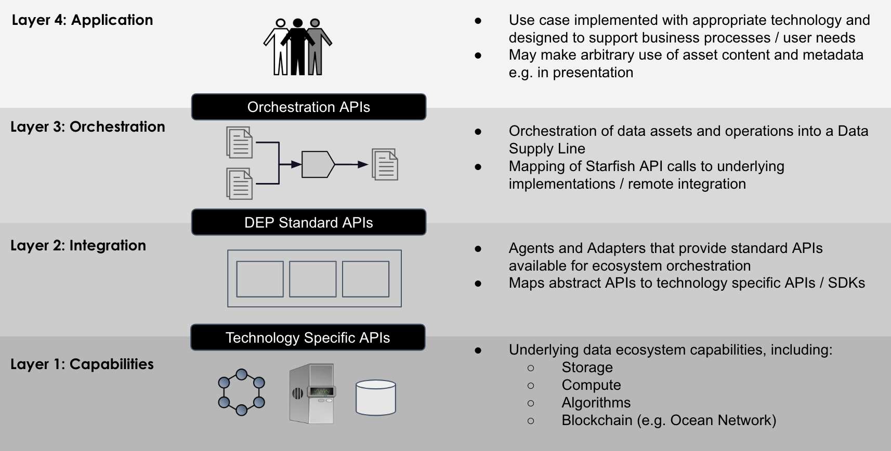
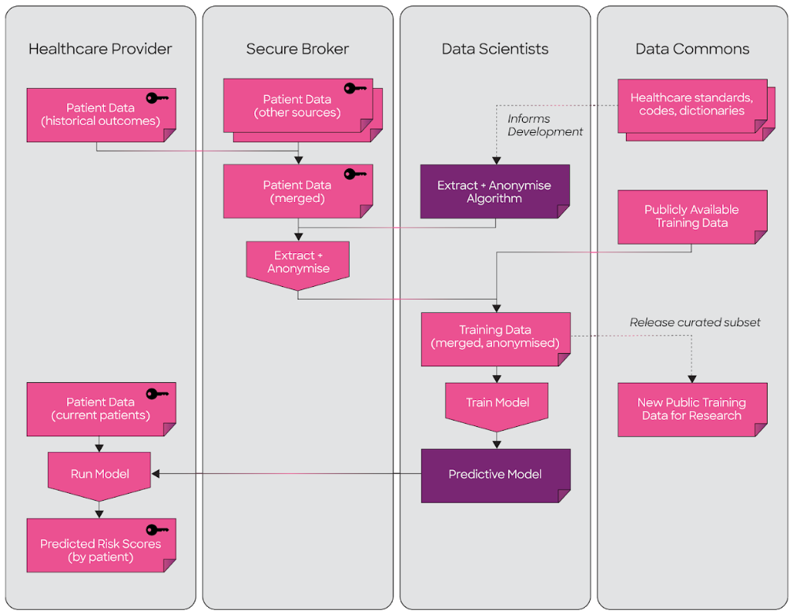

```
shortname: 3/ARCHITECTURE
name: Architecture & Principles
type: Standard
status: Draft
editor: Mike Anderson <mike.anderson@dex.sg>
contributors: 
```

Table of Contents
=================

   * [Table of Contents](#table-of-contents)
   * [Architecture](#architecture)
      * [Vision](#vision)
      * [Principles](#principles)
      * [Architecture Layers](#architecture-layers)
      * [Decisions](#decisions)
      * [References](#references)
      * [License](#license)

# Architecture

This DEP describes the conceptual reference architecture for Decentralised Data Ecosystems supported 
by the broader set of DEP standards.

## Vision

We envision a world where:

- Data and AI services can be harnessed by all for the good of humanity, and
not controlled by a handful of powerful gatekeepers. 
- The costs of developing AI solutions are minimised, so that the value of the "long tail" of Data and AI
assets can be realised.
- Interoperability is built into the ecosystem from the ground up, so that solutions can be built to
span across a broad range of participants without expensive bespoke integration work.

It is the goal of this DEP to outline a reference architecture and architectural principles that can support
this vision. 

## Principles

- No centralised point of control
- Decentralised ownership of assets and services
- Support for orchestration of Data Supply Lines
- Decentralised trust rules
- Abstraction from specific technology choices
- Support for arbitrary data formats
- Available over the public internet
- Peer-to-peer model

## Architecture Layers

The components of a decentralised data ecosystem architecture can be conceptualised in four layers



### Application Layer

This layer is responsible for interaction with the end user and delivering value-creating functionality
to the ecosystem.

In general, applications in this layer will be custom applications or products designed to support a particular use
case or set of users. Examples might include:

 - A user-friendly data marketplace application allowing the buying and selling of data assets
 - A consumer website making use of data assets and services to improve customer experience
 - A data science project performing machine learning on customer data sets
 - An enterprise system making use of data assets for real-time decision making
 
### Orchestration Layer

This layer is responsible for orchestrating the interactions between decentralised data assets and services in
order to meet the requirements of the application layer. 

> “Being abstract is something profoundly different from being vague... The purpose of abstraction is not to be vague, but to create a new semantic level in which one can be absolutely precise. ”
>
> (Edsger Dijkstra)

A central concept of the orchestration layer is to provide a toolkit required to assemble a flow of 
arbitrary data assets across arbitrary  participants, possibly including arbitrary computations, and thus forming a 
Data Supply Line. This is made possible by abstraction away from specific technologies to a common set of abstract
concepts (Assets, Operations, Agents etc.) that are defined in the DEP standards to have common interfaces.

Data Supply lines are typically orchestrated according to the custom requirements of the use case they are serving.
For example, the diagram below shows the application of predictive modelling to anonymised patient data sets from
multiple healthcare providers, with secure aggregation of data handled by a trusted broker. 



A significant set of open source software code providing the functionality for this layer is provided in
the form of the Starfish developer toolkit (described in [DEP4](../4/README.md), which includes a set of libraries suitable for orchestrating
data assets and services according to the DEP standards.

A typical pattern for implementing the orchestration layer is therefore for the user application to make use
of the Starfish libraries to provide orchestration capabilities. This is the recommended approach, however 
implementors may choose a different model (e.g. adopting an enterprise middleware solution to perform this 
orchestration function).

### Integration Layer

This layer is responsible for providing access to data assets and services in the ecosystem under the control
of a service provider. 

In order to enable ecosystem interoperbility, the Integration layer must expose these assets and services to 
the ecosystem according to a set of abstract DEP standard APIs. Key examples of such APIs include:
 - Ability to remotely invoke compute operations (see [DEP6](../6/README.md))
 - Access to raw asset data (see [DEP7](../7/README.md))
 - Access to asset metadata and provenance (see [DEP15](../15/README.md))

Typically the layer is implemented as a set of one or more Agents which are hosted in a secure environment 
controlled by the service provider. These agents would serve their capabilites via APIs either to the whole
ecosystem via the public internet or to a closed set of participants via a VPN / private network.

The integration layer is responsible for enforcing any trust rules and access controls required by the 
service provider, and may require access to the underlying storage and compute infrastructure that is being 
managed by a service provider. For this reasons, it is extremely important that appropriate measures
are taken to ensure the security of this layer, particularly if sensitive assets are at risk.

### Capability Layer

This layer provides the underlying data assets and services.

Because a layer of abstraction is provided via the integration layer, there is no restriction on the type of
underlying technology used. This is a significant advantage of this layered design, because it allows
any existing storage / compute infrastructure to be plugged in to the global decentralised data ecosystem
without the need for expensive replacements or upgrades (typically, a lightweight adapter to play the role
of the integration layer is all that is required).

Examples of capabilities that may be valuable to integrate into the data ecosystem include:
 - Big Data storage and compute technologies (e.g. Spark, Hadoop )
 - Traditional storage (e.g. file systems, SQL databases)
 - Secure Compute Hardware (e.g. Intel SGX)
 - Proprietary machine learning algorithms
 - Data cleaning / ETL processes
 - Decentralised networks (e.g. IPFS, Filecoin)

Note that these capabilities may be under the control of a single service provider (who may also be the data owner)
but could also be fully decentralised capabilities.


## Decisions

TBD: Architecture decisions under review

| Topic         | Decision                                                         |
|---------------|---------------------------------------------------------------------|
|           xx | xx                                                             |


## References

TBC:

* A - https://foo.org

## License

Copyright (c) 2019 DEX Pte. Ltd.

This DEP is free software; you can redistribute it and/or modify it under the terms of the Apache 2.0 License
