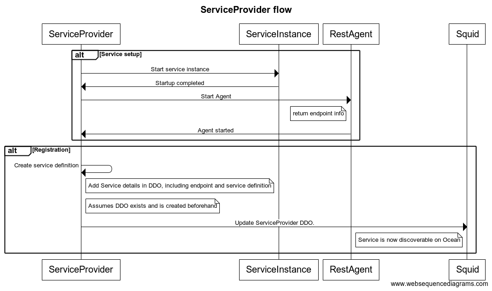
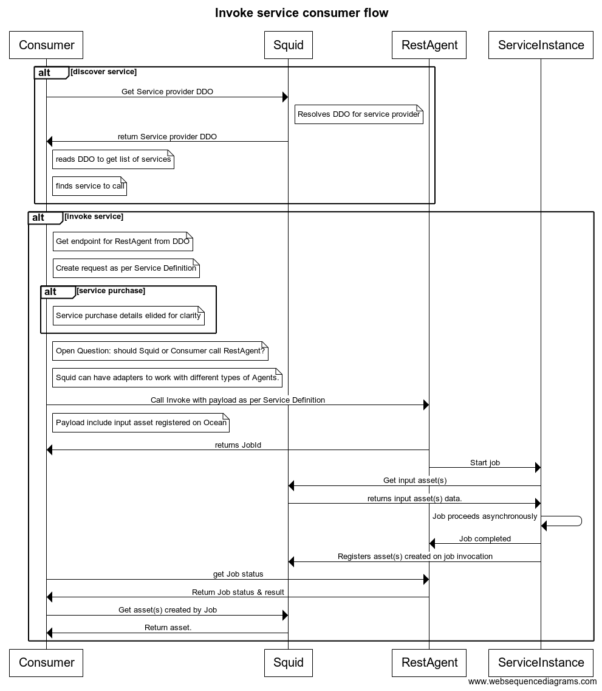

```
shortname: 6/CSAPI
name: API to register & invoke computer services   
type: Standard
status: Raw
editor: Mike Anderson <mike.anderson@dex.sg>
contributors: Kiran K <kiran.karkera@dex.sg> 
```

<!--ts-->

Table of Contents
=================

   * [Table of Contents](#table-of-contents)
   * [Invoke Job capability](#invoke-job-capability)
      * [Exclusions](#exclusions)
      * [Change Process](#change-process)
      * [Language](#language)
      * [Motivation](#motivation)
      * [Roles](#roles)
      * [Technical Requirements](#technical-requirements)
   * [Specification](#specification)
      * [Service Definition](#service-definition)
      * [Service Registration](#service-registration)
      * [Service Delivery](#service-delivery)
      * [FAQ](#faq)
      * [Open Questions](#open-questions)
      * [License](#license)

      
<!--te-->

<a name="service-invocation"></a>
# Invoke Job capability

The Service Invocation API (**INVOKE**) is a specification for the Ocean Protocol to register and invoke compute jobs.

INVOKE offers a general purpose computational interface that can run compute Jobs on demand.

Compute services are defined as services available on the Ocean Network that

* May accept one or more Input parameters (which will typically be data assets to be used or algorithms to be run)
* Typically produce one or more Outputs (which will typically be references to generated data assets)
* Support the provision of proofs by service providers upon service completion (after which tokens in escrow may be released) 

## Exclusions

* This OEP does not prescribe the exact type of compute services offered. It is open to service provider implementations to define them, providing that they conform with this API specification
* This OEP does not cover service discovery.
* The OEP is not intended to apply to services where invocation / access is off-chain (e.g. high volume APIs or queue services)
* This OEP does not describe subscribable services, such as access to a dashboard for a fixed time period.
* This OEP does not describe installation of the service and/or its dependencies.

This specification is based on [Ocean Protocol technical whitepaper](https://github.com/oceanprotocol/whitepaper), [3/ARCH](../3/README.md), [4/KEEPER](../4/README.md) and [5/AGENT](../5/README.md).


<a name="change-process"></a>
## Change Process
This document is governed by the [2/COSS](../2/README.md) (COSS).

<a name="language"></a>
## Language
The key words "MUST", "MUST NOT", "REQUIRED", "SHALL", "SHALL NOT", "SHOULD", "SHOULD NOT", "RECOMMENDED", "NOT RECOMMENDED", "MAY", and "OPTIONAL" in this document are to be interpreted as described in [BCP 14](https://tools.ietf.org/html/bcp14) \[[RFC2119](https://tools.ietf.org/html/rfc2119)\] \[[RFC8174](https://tools.ietf.org/html/rfc8174)\] when, and only when, they appear in all capitals, as shown here.

<a name="motivation"></a>
## Motivation

Ocean network aims to power marketplaces for relevant AI-related data services.
There is a need for a standardised **interface** for the invocation of compute services so that different implementations can be provided and invoked by users of the Ocean Protocol.

Example of data related services that could be offered by Ocean actors:

* A data cleaning service that removes noise from data
* A model training service that returns a trained model given training data
* A model verification service that returns metrics of a model's performance, given a model and a test data set.
* A consent service which filters a dataset by checking each dataset instance (e.g. a single patient's data in a healthcare study) against an external consent registry.

It may be observed that these services

- Enable creation of dataset(s)
- Accept input dataset(s) and transform it in some fashion

The Invoke API enables

- provides Ocean users tools to transform data assets registered on the Ocean network.
- facilitates a workflow pipeline of data asset transformations.
- enables provenance tracking by Ocean provenance aware algorithms.

<a name="specification"></a>

## Roles

- Asset/algorithm owner: The owner of the algorithm, 
  - may be registered as an Ocean asset
  - may be available as a deployable package (e.g. a docker image or a jar on a maven repo)
- Service provider: The entity that runs the algorithm on their server(s).
- Service consumer: The entity that invokes the service.a
- Service instance: The software entity that is running the invokable service. 
- Agent: The software entity that enables Service Instance interactions  with the rest of the Ocean community.
  - Agent can be of many types, such as local or remote, and communicate via different interfaces.
  - The rest of this document assumes a remote Agent that communicates over REST.

### Provider flow



### Consumer flow



## Technical requirements 

* The service may be offered free or for a price
* The service may be offered in trusted mode or trustless mode (backed by Service Execution Agreements) 
* the service must be identified with its asset ID on the Ocean Network
* the service must register its metadata with the OCEAN agent
* may accept configuration options to tune the algorithm/job to be run.
* may register ocean assets generated as a result of the job. the registered assets must be in the name of the service coinsumer
* may return a payload
* may accept a list of ocean assets as inputs to the job  (along with access tokens to consume the asset)
* may accept a data payload as an input
* The unit of measurement must be 
  - a one-shot execution of a job (e.g. a data cleaning job)
  
# Specification 

The **Service Metadata** information should be managed using an API on the Ocean Agent. 
This API should expose the following capabilities in the Ocean Agent via HTTP REST.

The service provider makes the service available in two temporal phases:

### Service registration

The service provider registers the service and provides the spec for the Service Definition. This information describes 

- the endpoints at which the service(s) are available
- the configuration options accepted by the invoke method(s)
- list of mandatory and optional arguments and their types, accepted by the invoke methods
- sync/async nature of invoke methods
- data returned by methods.

### Service delivery

The Service Delivery phase consists of 

- the consumer calling the invoke method(s) 
- the service executing the invoke methods. These could be jobs that take a significant amount of time to complete.
- the consumer retrieving the result(s) of the invoke method(such as data payloads, created assets and/or associated proofs), or getting a notification (e.g. via a webhook).

The service spec consists of 2 parts, Service definition and Service Invocation. The service provider publishes the service defintion 

## Service definition

The service definition is JSON formatted content, which is a part of the Service Provider DDO. 
It contains the following sections sections:

- service description: name and description fields
- inputs: a list of maps, each of which contains data about a single argument.
- outputs: a list of maps, each of which contains data about an artifact returned by the invocation.
- service info: consumer-provided params on the service invocation, including data about the service agreements.
- configuration options: these are provider specified options to tune the invoke job.

Example of service definition:

```json 
{
 "servicedescription": {"name": "name of service",
                        "description" : " free form description of service  ",
                        "agent_type": "rest"},
  
  "inputs" : [ 
              {
             "argname" :"inputasset1",
             "type": "oceanasset",
             "mandatory" : "true",
             }
             ]},
  "outputs": [ 
              {"argname" : "arg",
              "type": "oceanasset"}
  ], 
  "serviceinfo" : {
      "consumerid" : "consumerid", 
      "invokeserviceagreementid" : "in_said",
      },
  "configuration" : {
      "job" : "options"
  }
}
```


#### Service Info fields:

| param                  | description                                         | Mandatory? |
|------------------------|-----------------------------------------------------|------------|
| consumerid             | user id of the consumer                             | no         |
| invokeserviceagreementid | service agreement of the (purchased) invoke service | no         |


The service definition must be included in the Service provider DDO thus:
```json
{

    //metadata described in OEP 8
    "services" : [
    {"name": "service name",
     "description" : "description of the service ",
     "servicedefinition": {  
         //service definition described above
        },
     "endpoint" : "https://service-url"}
    ]
}

```

- The DDO must contain a list against the "services" key
- Each item in the list is a map which must contain
  - name 
  - description
  - service definition (described above)
  - service endpoint


### Inputs/outputs

The invoke service can be modeled as a function invocation. In the following example

```java
public String callFunction(String input1, Integer input2)
```

observe that *callFunction* takes
- a list of inputs, where each input has a name & a type definition
- a single output, with a type definition

The invoke service is modeled in the same fashion, where the *invoke* function takes a list of inputs, each of which has a name and type, and returns a *list* of outputs, each of which has a name & a type.

Currently, two *types* of inputs have been defined

- Ocean inputs: these are registered Ocean assets accepted as inputs to the invocation.

The *oceanasset* type needs the following parameters:

| param              | description                                 | Mandatory? |
|--------------------|---------------------------------------------|------------|
| assetid            | is the id of the asset on the Ocean network | yes        |
| asseturl           | the URL where the asset is consumed from    | yes        |
| serviceagreementid | ID of the service agreement                 | no         |
| assetmetadataurl   | URL where the asset metadata is hosted      | no         |

- payloads: this is a data passed to the function invocation. 

### Service info

This section contains information about 

- consumer identity 
- service agreements

### Configuration

This section contains configuration options or tunable parameters.


## Service Registration
 
### Registering a new Service

Registering a service 

* requires that the service provide add the service details into the DDO and publish the updated DDO.

### Retire a Service

Retiring a service requires that the service provider remove the service details from its DDO and update the DDO

## Service Delivery

The rest of this document assumes that a REST Agent is used to delivering the service.

### Heartbeat

This endpoint is used by the consumer or Squid to check if the service is available

#### Request

- a GET request to the https://service-endpoint/heartbeat 

#### Response

| response code | description          | payload |
|---------------|----------------------|---------|
|           200 | service available  | empty|
|           500 | server error  | data describing the error |
|           503 | service unavailable | data describing the error |


### Invoke a job (async)

This is the primary interface by which a consumer can invoke a service/run a job.

#### Request

- a POST request to the https://service-endpoint/jobs , along with JSON formatted payload as described in the Service Definition.

Here's an example of an invocation that defines a single input asset of type oceanasset.
```json 
{
  "inputs" : [ 
              {
             "argname" :"inputasset1",
             "type": "oceanasset",
             "mandatory" : "true",
             "assetid" : "ocnassetid",
             "asseturl" : "url to consume the asset ",
             "serviceagreementid" : "sa_id",
             }
             ],
    "serviceinfo": {
             "consumerid" : "consumerid",
             "invokeserviceagreementid" : "in_said" 
             }
  "configuration" : {
      "job" : "options"
  }
}
```

#### Request auth 

TBD

#### Arguments

The payload must contain data in the format specified in the service definition. 

#### Response

| response code | description          | payload |
|---------------|----------------------|---------|
|           201 | job creation success | jobid   |
|           400 | bad request-not according to presribed format or invalid configuration options | error description|
|           401 | not authorized (no authorization tokens provided) | error description|
|           500 | error                | error description |
|           503 | service unavailable | error description|
|           8003 | service not paid for by consumer | error description|

### Describe the status of the job

#### Request

- an HTTP GET request to https://service-endpoint/jobs/status/jobid

#### Arguments

The arguments are to be passed as HTTP query arguments

| argument   | description                       |
| --      |  --                               |
| consumerid | The consumer who invoked this job |
|            |                                   |

#### Response

| response code | description                                                | payload                   |
|---------------|------------------------------------------------------------|---------------------------|
|           200 | job status, one of: started, in progress, completed, error | {"status" : "inprogress"} |
|           400 | invalid job id|  |
|           500 | error                                                      |                         error description  |
|           8001 | input assets cannot be retrieved |  error description|
|           8002 | output assets cannot be registered | error description |

### Get the result of a job

#### Request

- an HTTP GET request to https://service-endpoint/jobs/result/jobid

#### Arguments

The arguments are to be passed as HTTP query arguments

| argument   | description                       |
| --         | --                               |
| consumerid | The consumer who invoked this job |
|            |                                   |

#### Response

| response code | description                                                | 
|---------------|------------------------------------------------------------|
|            200 | job result, a json formatted string| 
|           400 | invalid job id|  |
|           401 | not authorized (no authorization tokens provided) | error description|
|           500 | error                                                      | error description |

The json response is of the form

```json
{ "oceanoutputs" : [ "generatedassetid1", "generatedassetid2"]}

```

It can contain other keys such as non-Ocean payloads.
Note: this response section is underspecified. It needs to handle

- registering the generated asset on behalf of the service consumer
- specifying the service agreement, purchase price, additional metadata. 


## FAQ

- Can the API accept configuration options:
  - Yes the payload can contain any other inputs in the json object, other than ocean inputs

## Open questions


* Should Squid invoke the service, or should the consumer invoke the service directly? 

Comparing pros and cons if Squid invokes the service

| Pros                                                            | Cons                                        |
| --                                                              | --                                          |
| Easier for the consumer                                         | Difficult to Squid to handle being a proxy  |
| Easier to incorporate on/off chain auth mechanisms such as SAEs | Consumer needs to be aware of SAE internals |
| Easier to handle non-REST agents or local agents (e.g. k8s/Docker) | Harder to define what's the endpoint, and who's the provider in case of local installs |
  
## License

This DEP is free software; you can redistribute it and/or modify it under the terms of the GNU General Public License as published by the Free Software Foundation; either version 3 of the License, or (at your option) any later version.

This DOEP is distributed in the hope that it will be useful, but WITHOUT ANY WARRANTY; without even the implied warranty of MERCHANTABILITY or FITNESS FOR A PARTICULAR PURPOSE. See the GNU General Public License for more details.

You should have received a copy of the GNU General Public License along with this program; if not, see http://www.gnu.org/licenses.


